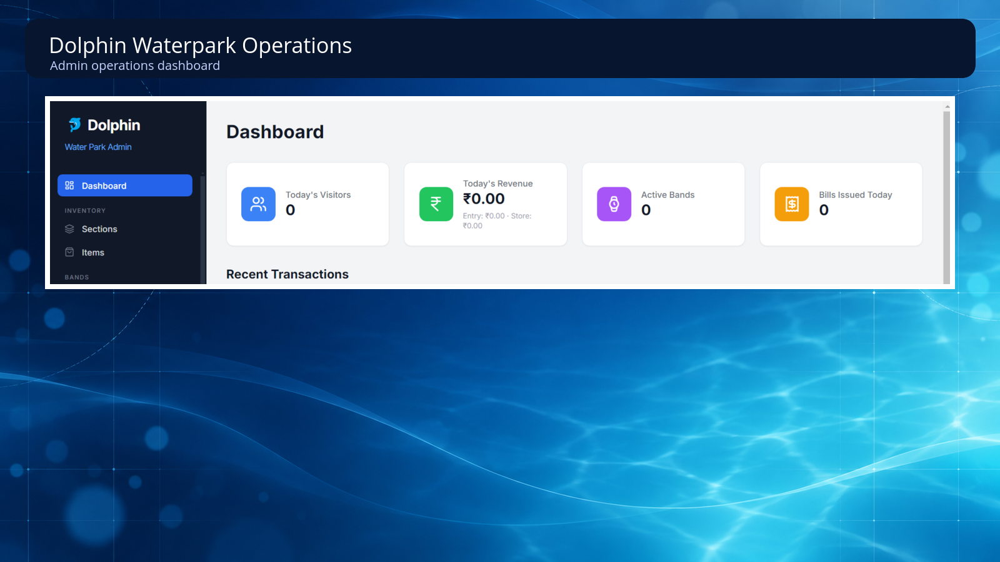
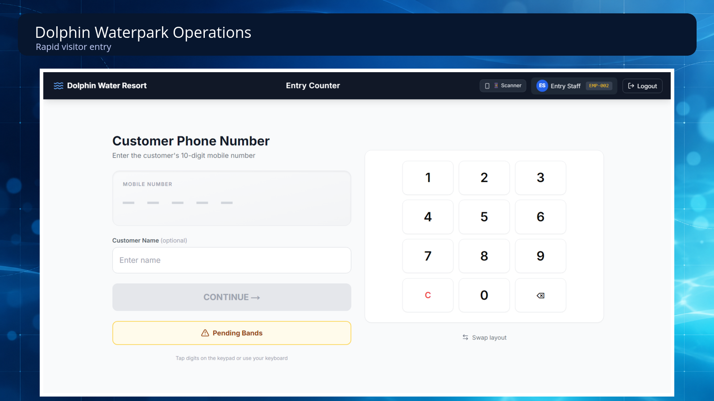
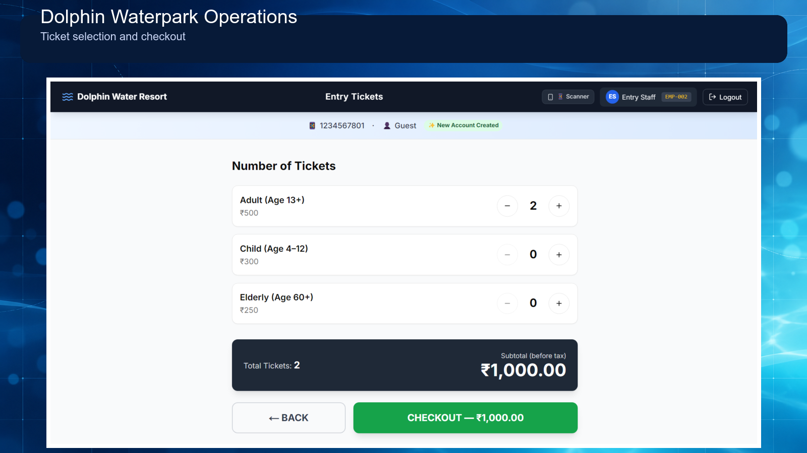
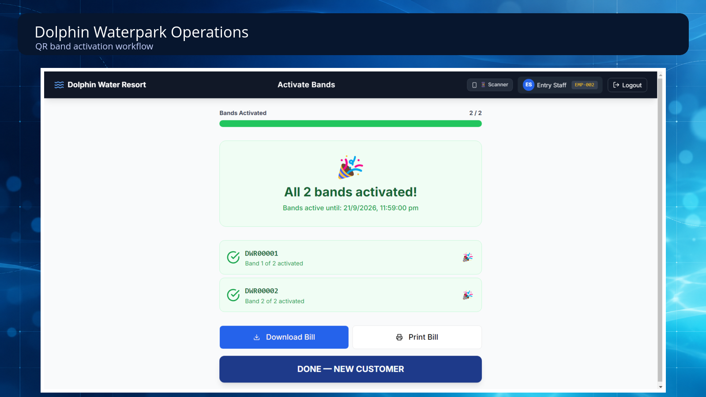
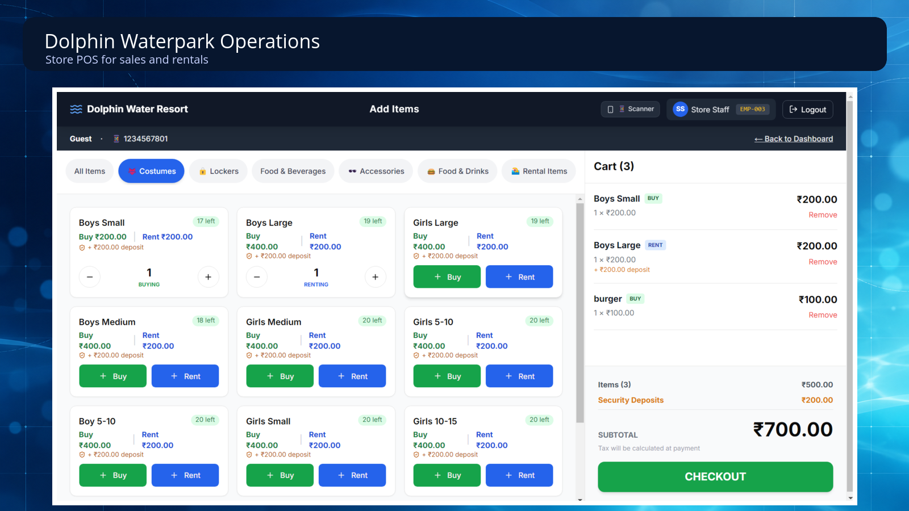
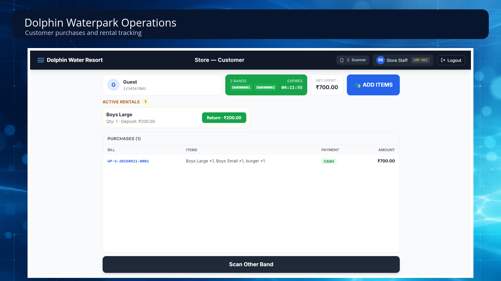

# Dolphin Waterpark Operations Platform — Product Case Study

**A unified web platform for waterpark ticketing, QR access, point of sale, rentals, coupons and operational reporting.**

> This is a presentation-only case study. Client and production source code remain private.

## Problem

Waterpark operations frequently become fragmented across ticket counters, entry verification, food or merchandise billing, equipment rentals and end-of-day reporting. The platform was designed to connect these workflows through one role-based system.

## Product areas

| Module | Purpose |
| --- | --- |
| Ticketing | Create and manage visitor tickets |
| QR access | Generate and scan session-linked visitor codes |
| Point of sale | Scan items, build carts and record charges |
| Rentals | Track rentable items and returns |
| Coupons | Apply controlled offers and discounts |
| Customer management | Maintain relevant visitor records |
| Employee management | Support role-based staff workflows |
| Reporting | Consolidate transactions and operational activity |

## My contribution

- Product workflow and data-model planning
- Full-stack implementation with Next.js and Firebase
- QR-based visitor and transaction workflows
- Role-aware interfaces for different operational users
- Reporting and administrative screens
- Android companion-app integration
- Firebase deployment and backend configuration

## Technology

Next.js · React · TypeScript · Firebase · Firestore · Cloud Functions · QR workflows · Android

## Simplified workflow

```text
Ticket creation
      ↓
QR-linked visitor/session
      ↓
Entry, POS and rental scans
      ↓
Charges and operational records
      ↓
Unified reports
```

## Sanitised interface walkthrough

The screens below use a controlled demonstration flow. Customer details and live operational records are excluded.

### 1. Admin operations overview



The administrator dashboard consolidates visitor activity, revenue, active bands, bills and operational navigation.

### 2. Fast entry and ticket selection

<table>
  <tr>
    <td width="50%" valign="top">
      
      <p><strong>Entry counter.</strong> Staff can start a visit from a mobile number or keypad-based entry flow.</p>
    </td>
    <td width="50%" valign="top">
      
      <p><strong>Ticket selection.</strong> Adult, child and elderly tickets feed a clear total before payment.</p>
    </td>
  </tr>
</table>

### 3. Payment and QR band activation



Each paid visit progresses to band activation, giving staff an explicit completion state and traceable handoff.

### 4. Store, rentals and customer history

<table>
  <tr>
    <td width="50%" valign="top">
      
      <p><strong>Store POS.</strong> Items can be sold or rented, with deposits and a live cart shown together.</p>
    </td>
    <td width="50%" valign="top">
      
      <p><strong>Customer history.</strong> Active rentals and completed purchases remain visible in the staff workflow.</p>
    </td>
  </tr>
</table>

## Privacy and source availability

The interface images use a controlled demonstration flow. This public case study excludes client source code, production configuration, real customer records, QR values, credentials and business-sensitive reporting.
